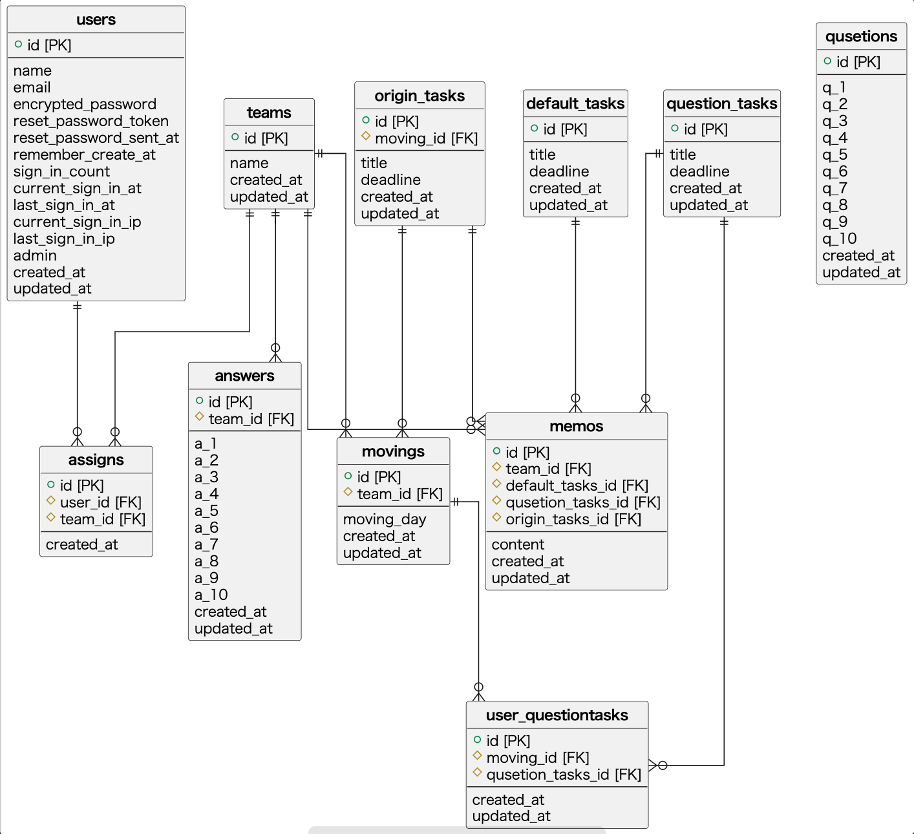
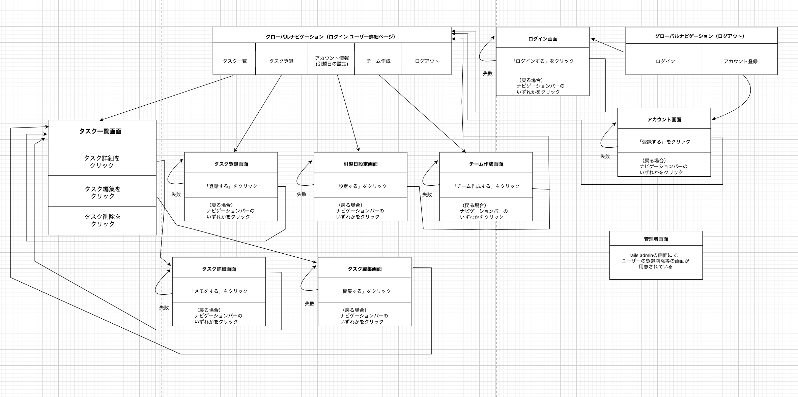

# README

# 開発言語
* Ruby3.0.1
* Rails6.0.3

<br>

# 就職Termの技術
* AWS
* devise
* rails_admin
* cancancan
* Ajaxを使ったコメント機能

<br>

# カリキュラム外の技術
* ranked-model

<br>

# 実行手順
```
$ git clone git@github.com:yuki-3110/moving_support.git
$ cd moving_support
$ bundle install
$ rails db:create && rails db:migrate
$ rails s
```

<br>

# カタログ設計
https://docs.google.com/spreadsheets/d/1MATua8gl4rwt0DhGP5CmsswUq4UbjMmLFTjiuIJoEZM/edit?usp=sharing

<br>

# テーブル定義書
https://docs.google.com/spreadsheets/d/1MATua8gl4rwt0DhGP5CmsswUq4UbjMmLFTjiuIJoEZM/edit?usp=sharing

<br>

# ワイヤーフレーム
https://prottapp.com/app/#/projects/62f104304942fb493009d059/assets/62f12aaa4942fb493009e287

<br>

# ER図
  

<br>

# 画面遷移図
  
